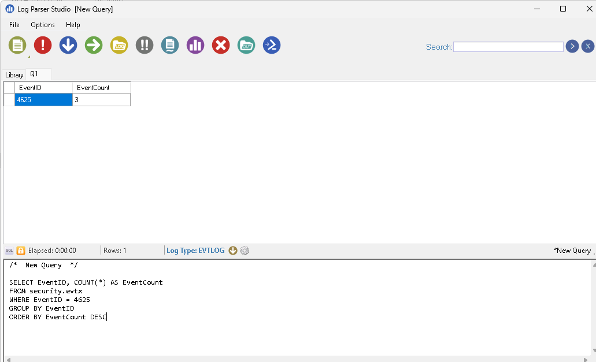
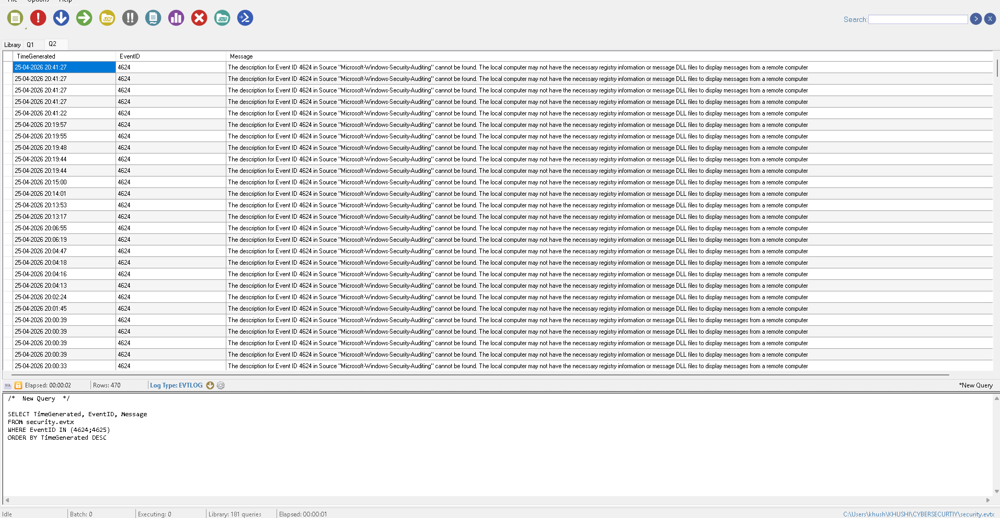

# 🔐 Windows Event Log Analysis Lab (SOC Practice)

## 📌 Overview

This project demonstrates hands-on analysis of Windows Event Logs to detect potential security incidents such as failed login attempts, brute-force activity, and suspicious system behavior.

---

## 🛠 Tools Used

* Windows Event Viewer
* Log Parser Studio

---

## 🔍 Activities Performed

### 1. Accessed System & Security Logs

* Navigated through Windows Event Viewer
* Explored System and Security logs

---

### 2. Identified Key Security Events

* **4624** → Successful login
* **4625** → Failed login
* **4672** → Admin privileges assigned
* **4688** → Process creation

---

### 3. Filtered and Searched Logs

* Filtered logs using Event ID **4625**
* Generated failed login attempts manually
* Used Find option to track user activity

---

### 4. Event Analysis & Correlation

* Observed multiple failed login attempts followed by a successful login
* Identified brute-force pattern:

```
4625 → 4625 → 4625 → 4624
```

* Extracted key details:

  * Username
  * Timestamp
  * System activity

---

### 5. Advanced Analysis using Log Parser Studio

#### 🔹 Query 1: Count Failed Logins

```sql
SELECT EventID, COUNT(*) AS EventCount
FROM 'security.evtx'
WHERE EventID = 4625
GROUP BY EventID
ORDER BY EventCount DESC
```

#### 🔹 Query 2: Login Timeline Analysis

```sql
SELECT TimeGenerated, EventID, Message 
FROM security.evtx
WHERE EventID IN (4624;4625) 
ORDER BY TimeGenerated DESC 
```

---
## 📸 Sample Output

### 🔹 Failed Login Count


---

### 🔹 Login Timeline Analysis


---

## 📊 Findings

* Detected multiple failed login attempts (Event ID 4625)
* Identified login patterns indicating possible brute-force activity
* Correlated events to understand sequence of actions
* Gained hands-on experience in log-based investigation

---

## 📁 Project Structure

* `queries/` → SQL queries used
* `notes/` → Event IDs and analysis notes
* `screenshots/` → Output evidence

---

## 👩‍💻 Learning Outcome

* Hands-on experience with Windows Event Logs
* Ability to filter, analyze, and correlate security events
* Basic incident investigation skills aligned with SOC Analyst role

---

## 🚀 Future Improvements

* Add PowerShell log analysis (Event ID 4104)
* Integrate with SIEM tools like Splunk
* Automate log analysis using Python
